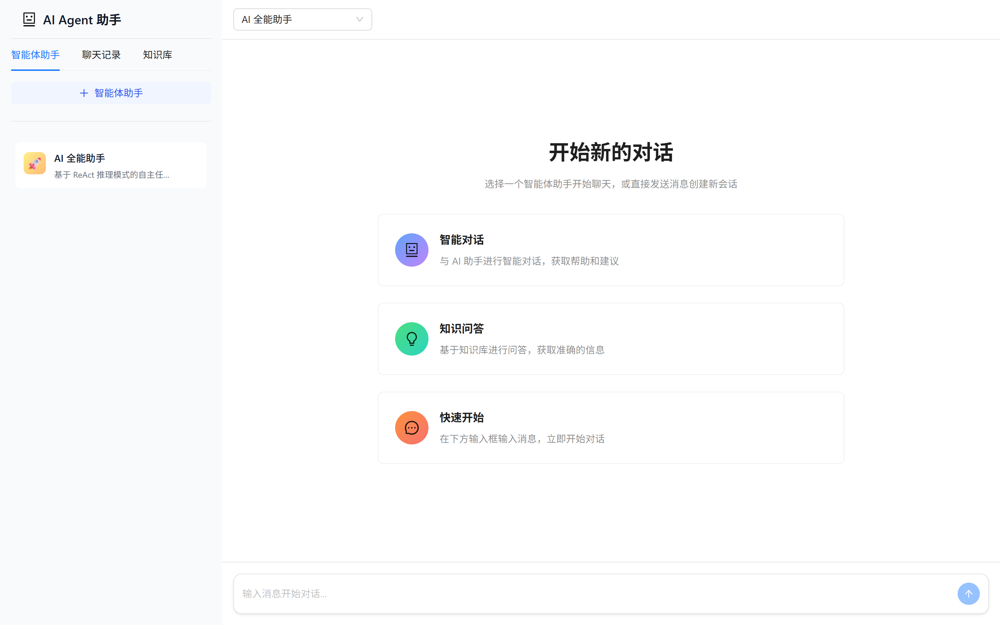
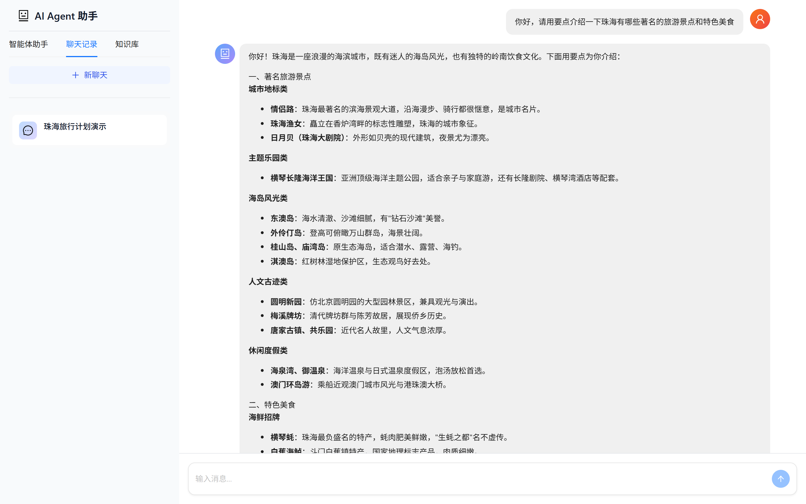
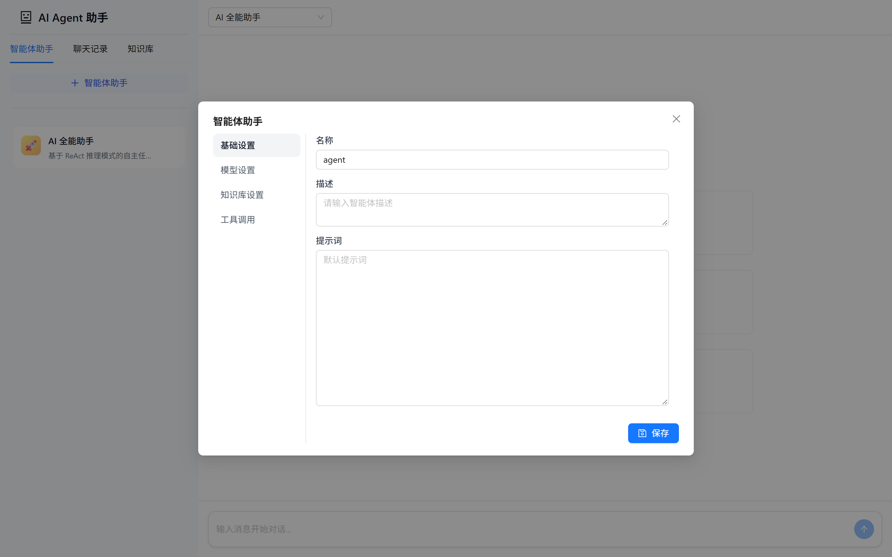
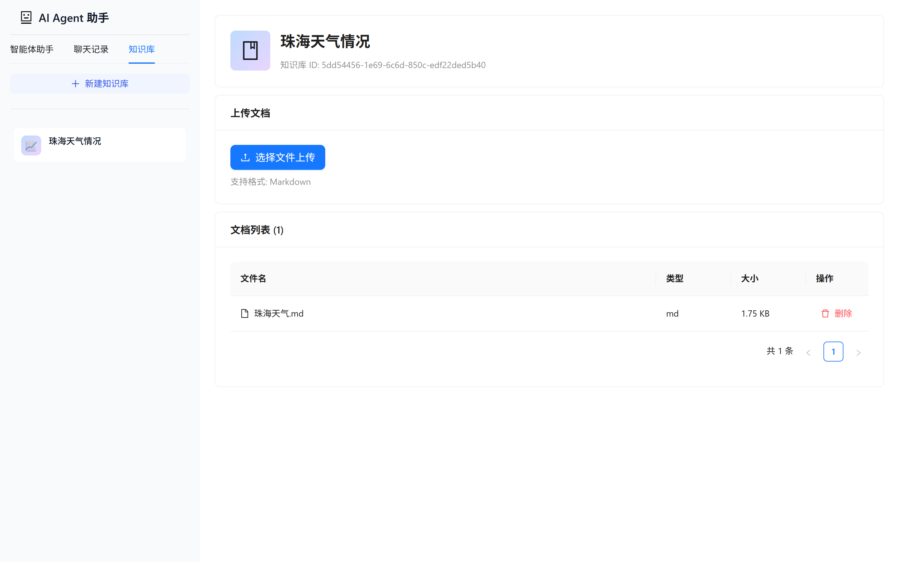
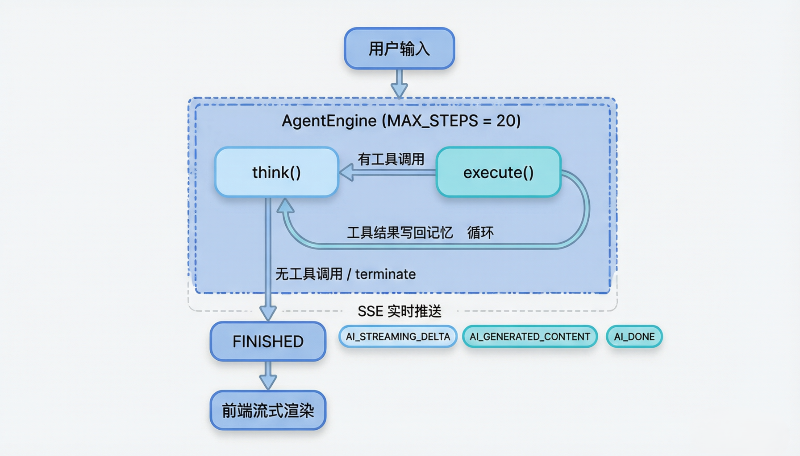

# AI Agent 助手

> 基于 **Spring AI 1.1 + Spring Boot 3.4 + Java 21** 构建的自主任务规划智能体平台，采用 **ReAct（Reasoning + Acting）** 推理模式，支持多模型接入、工具调用（Tool Calling）、RAG 知识库检索、SSE 流式输出与文档自动化生成。前端使用 **React 19 + Ant Design X** 打造现代化对话式交互界面。

[](https://openjdk.org/)
[](https://spring.io/projects/spring-boot)
[](https://spring.io/projects/spring-ai)
[](https://react.dev/)
[](https://postgresql.org/)

---

## 目录

- [项目简介](#项目简介)
- [功能预览](#功能预览)
- [核心特性](#核心特性)
- [技术栈](#技术栈)
- [系统架构](#系统架构)
- [内置工具](#内置工具)
- [数据库设计](#数据库设计)
- [API 接口](#api-接口)
- [环境要求](#环境要求)
- [快速开始](#快速开始)
- [配置说明](#配置说明)
- [项目结构](#项目结构)

---

## 项目简介

**AI Agent 助手** 是一个全栈 AI 智能体应用平台。它不是简单的「问答机器人」，而是一个能够 **自主规划、思考并执行** 的 Agent 系统：

- 用户提出一个复杂任务后，Agent 会将其拆解为多个步骤；
- 在每一轮 **think → execute** 循环中，模型决定调用哪个工具（检索知识库、读写文件、生成 PDF、执行命令等），拿到结果后再决定下一步；
- 整个推理与执行过程通过 **SSE 流式** 实时推送到前端，用户可以看到逐字生成的回复与工具调用状态；
- 支持 **多智能体** 与 **多会话**，每个智能体可独立配置模型、系统提示词、可用工具与关联知识库；
- 内置 **RAG 知识库**，上传 Markdown 文档后自动向量化入库，问答时进行语义检索增强。

---

## 功能预览

### 首页 · 开始新的对话

进入应用后展示引导首页，左侧可切换「智能体助手 / 聊天记录 / 知识库」，顶部下拉选择智能体，也可直接输入消息创建新会话。



### 对话 · 流式输出与工具调用

选择智能体后进入对话界面。用户消息（右侧橙色头像）与助手回复（左侧蓝色头像）分列展示，助手回复以 Markdown 渲染并逐 token 流式输出，工具调用过程实时可见。



### 智能体配置

通过弹窗可完整配置一个智能体：基础设置（名称 / 描述 / 提示词）、模型设置（温度 / top_p / 上下文长度）、知识库设置与工具调用授权。



### 知识库管理

创建知识库并上传 Markdown 文档，系统自动完成解析、分块与向量化，供智能体检索问答使用。



---

## 核心特性

| 特性 | 说明 |
| --- | --- |
| 🔁 **ReAct 自主推理** | think → execute 循环，最多 20 步，模型自主决定工具调用与任务终止 |
| 🧩 **工具调用（Tool Calling）** | 基于 Spring AI `@Tool` 注解，插件式工具体系，按智能体授权启用 |
| 📚 **RAG 知识库检索** | Ollama `bge-m3` 嵌入 + PostgreSQL `pgvector` 向量库，语义相似度检索 |
| ⚡ **SSE 流式输出** | 逐 token 实时推送，前端打字机效果，工具状态即时反馈 |
| 🤖 **多模型接入** | DeepSeek、智谱 ZhipuAI 等大模型，支持 MCP（Model Context Protocol）客户端 |
| 👥 **多智能体 / 多会话** | 独立配置模型参数、系统提示词、工具集与知识库关联 |
| 📄 **文档自动化** | Markdown 转 PDF（中文字体支持）、文件读写、资源下载、网页抓取 |
| 🖥️ **终端执行** | 在受控环境下执行终端命令，扩展 Agent 能力边界 |

---

## 技术栈

### 后端

| 类别 | 技术 | 版本 |
| --- | --- | --- |
| 语言 / 运行时 | Java | 21 |
| 应用框架 | Spring Boot | 3.4.4 |
| AI 框架 | Spring AI | 1.1.0 |
| 大模型 | DeepSeek / 智谱 ZhipuAI | - |
| 关系数据库 | PostgreSQL | - |
| 向量检索 | pgvector | - |
| ORM | MyBatis-Plus | 3.5.7 |
| 嵌入模型 | Ollama `bge-m3`（1024 维） | - |
| 协议扩展 | MCP Client（SSE） | - |
| 响应式 | Spring WebFlux | - |
| 实时推送 | SSE（SseEmitter） | - |
| PDF 生成 | iText | 9.1.0 |
| Markdown / HTML | flexmark / jsoup | - |
| 工具库 | Hutool | - |
| 接口文档 | Knife4j / springdoc（OpenAPI 3） | - |

### 前端

| 类别 | 技术 | 版本 |
| --- | --- | --- |
| 框架 | React | 19.2 |
| 语言 | TypeScript | 5.9 |
| 构建工具 | Vite（rolldown-vite） | 7.2 |
| UI 组件库 | Ant Design | 6.0 |
| AI 对话组件 | @ant-design/x（Bubble / Sender） | 2.0 |
| Markdown 渲染 | @ant-design/x-markdown | 2.0 |
| 样式 | Tailwind CSS | 4.1 |
| 路由 | React Router | 7.9 |

---

## 系统架构

### ReAct Agent 执行流程



- **think()**：以流式方式调用大模型，逐 token 通过 SSE 推送 `AI_STREAMING_DELTA`；流结束后解析是否包含工具调用。
- **execute()**：关闭 Spring AI 内置自动工具执行（`internalToolExecutionEnabled=false`），由 `ToolCallingManager` 手动执行，将工具结果写回会话记忆，持久化 `tool` 角色消息并推送 `AI_GENERATED_CONTENT`。
- **终止**：模型无工具调用或调用 `terminate` 工具时结束循环，发送 `AI_DONE`。

### 前后端交互

- 前端通过 `POST /api/chat/{agentId}/send` 发送用户消息（后端立即持久化并异步运行 Agent）。
- 前端通过 `GET /api/sse/connect/{chatSessionId}` 建立 SSE 长连接，接收流式回复与工具状态。

---

## 内置工具

工具通过 Spring AI `@Tool` / `@ToolParam` 注解定义，创建智能体时按需授权。

| 工具 | 类型 | 说明 |
| --- | --- | --- |
| `directAnswer` | 固定 | 直接回答用户问题，适用于无需调用其他工具的场景 |
| `terminate` | 固定 | 终止 Agent 循环，任务完成或无法继续时调用 |
| `KnowledgeTool` | 可选 | 从关联知识库进行语义检索（RAG） |
| `fileOperation` | 可选 | 文件读取 / 写入操作 |
| `pdfGeneration` | 可选 | 将 Markdown 内容生成为 PDF（含中文字体三级兜底） |
| `resourceDownload` | 可选 | 从 URL 下载资源 |
| `terminalOperation` | 可选 | 在受控环境执行终端命令 |
| `webSearch` | 可选 | 联网搜索 |
| `webScraping` | 可选 | 网页内容抓取（jsoup 解析） |

---

## 数据库设计

PostgreSQL（启用 `pgvector` 扩展），共 7 张核心表：

| 表名 | 说明 |
| --- | --- |
| `agent` | 智能体配置（名称、系统提示词、模型、允许工具、允许知识库、对话参数） |
| `chat_session` | 会话（关联智能体、标题） |
| `chat_message` | 消息（role：user / assistant / tool，content，metadata JSONB 存工具调用） |
| `tool` | 工具注册表（名称、描述、类型） |
| `knowledge_base` | 知识库 |
| `document` | 文档（关联知识库、文件名、类型、大小） |
| `chunk_bge_m3` | 文档分块向量表（`VECTOR(1024)`，ivfflat 索引） |

建表脚本见 [`src/main/resources/schema.sql`](src/main/resources/schema.sql)。

---

## API 接口

所有接口以 `/api` 为上下文前缀，统一返回 `BaseResponse<T>`（`code` / `data` / `message`）。启动后访问 Knife4j 文档：`http://localhost:8123/api/doc.html`。

### 智能体管理 `/agents`

| 方法 | 路径 | 说明 |
| --- | --- | --- |
| POST | `/agents` | 创建智能体 |
| GET | `/agents` | 智能体列表 |
| GET | `/agents/{id}` | 智能体详情 |
| PATCH | `/agents/{id}` | 部分更新 |
| DELETE | `/agents/{id}` | 删除 |

### 会话管理 `/chat-sessions`

| 方法 | 路径 | 说明 |
| --- | --- | --- |
| POST | `/chat-sessions` | 创建会话 |
| GET | `/chat-sessions` | 会话列表 |
| GET | `/chat-sessions/agent/{agentId}` | 按智能体获取会话 |
| GET | `/chat-sessions/{id}` | 会话详情 |
| PATCH | `/chat-sessions/{id}` | 更新会话 |
| DELETE | `/chat-sessions/{id}` | 删除会话 |

### 对话与消息

| 方法 | 路径 | 说明 |
| --- | --- | --- |
| POST | `/chat/{agentId}/send` | 发送消息（触发 Agent 异步执行） |
| GET | `/sse/connect/{chatSessionId}` | 建立 SSE 流式连接 |
| GET | `/chat-messages/session/{sessionId}` | 获取会话消息（默认最近 20 条，时间正序） |
| PATCH | `/chat-messages/{id}/append` | 追加内容到消息末尾 |
| PATCH | `/chat-messages/{id}/content` | 全量更新消息内容 |
| DELETE | `/chat-messages/{id}` | 删除消息 |

### 知识库与文档

| 方法 | 路径 | 说明 |
| --- | --- | --- |
| POST | `/knowledge-bases` | 创建知识库 |
| GET | `/knowledge-bases` | 知识库列表 |
| GET | `/knowledge-bases/{id}` | 知识库详情 |
| DELETE | `/knowledge-bases/{id}` | 删除知识库 |
| POST | `/documents/upload` | 上传文档（自动解析 + 向量化入库） |
| GET | `/documents/kb/{kbId}` | 按知识库获取文档列表 |
| DELETE | `/documents/{id}` | 删除文档 |

### 工具

| 方法 | 路径 | 说明 |
| --- | --- | --- |
| GET | `/tools` | 获取可用工具列表 |

---

## 环境要求

| 组件 | 要求 |
| --- | --- |
| JDK | 21+ |
| Maven | 3.8+ |
| Node.js | 20+ |
| PostgreSQL | 需安装并启用 `pgvector` 扩展 |
| Ollama | 需拉取 `bge-m3` 嵌入模型 |
| 大模型 API Key | DeepSeek / 智谱（配置于 `application.yml`） |

---

## 快速开始

### 1. 准备数据库

创建数据库并启用 pgvector：

```sql
CREATE DATABASE ai_agent;
\c ai_agent
CREATE EXTENSION IF NOT EXISTS vector;
```

应用启动时会自动执行 `schema.sql` 建表（首次运行）。

### 2. 准备嵌入模型

```bash
ollama pull bge-m3
```

### 3. 启动后端

```bash
# 修改 src/main/resources/application.yml 中的数据库连接与模型 API Key
mvn spring-boot:run
```

后端运行于 `http://localhost:8123`，上下文路径 `/api`。

### 4. 启动前端

```bash
cd UI
npm install
npm run dev
```

前端运行于 `http://localhost:5173`，开发环境通过 Vite 代理将 `/api` 转发至后端。

### 5. 使用流程

1. 打开首页 → 点击「智能体助手」→ 新建一个智能体（选择模型、授权工具）；
2. （可选）在「知识库」中新建知识库并上传 Markdown 文档；
3. 选择智能体发起对话，观察流式回复与工具调用效果。

---

## 配置说明

核心配置位于 [`src/main/resources/application.yml`](src/main/resources/application.yml)：

| 配置项 | 说明 |
| --- | --- |
| `server.port` / `server.servlet.context-path` | 服务端口 `8123` 与上下文 `/api` |
| `spring.ai.openai.*` | 大模型接入（Base URL、API Key、模型名） |
| `spring.ai.ollama.*` | Ollama 嵌入模型（`bge-m3`） |
| `spring.ai.mcp.client.*` | MCP 客户端（如 image-search，SSE 方式） |
| `spring.datasource.*` | PostgreSQL 数据源 |
| `spring.ai.vectorstore.*` | 向量库（`similarity-top-k` 等检索参数） |

> DeepSeek 思考模式通过 `DeepSeekThinkingModeConfig` 使用 RestClient 拦截器注入 `thinking.disabled`，以兼容其流式接口。

---

## 项目结构

```
ai-agent-spring-ai/
├── src/main/java/com/example/aiagent/
│   ├── agent/            # AgentEngine（ReAct 引擎）、AgentFactory
│   ├── advisor/          # ChatClient 增强器
│   ├── config/           # 模型/向量库/MCP/思考模式等配置
│   ├── controller/       # REST 接口（智能体/会话/消息/知识库/文档/工具/SSE）
│   ├── service/          # 业务服务 + facade 门面层
│   ├── tools/            # 内置工具实现（@Tool）
│   ├── mapper/           # MyBatis-Plus Mapper
│   ├── model/            # dto / entity / request / response / vo
│   ├── message/          # SseMessage（SSE 消息协议）
│   ├── event/            # 事件与监听器
│   └── typehandler/      # JSONB 类型处理器
├── src/main/resources/
│   ├── application.yml   # 主配置
│   ├── schema.sql        # 建表脚本
│   └── mapper/           # MyBatis XML
├── UI/                   # React 前端
│   └── src/
│       ├── components/   # 视图与组件（对话、侧边栏、弹窗等）
│       ├── api/          # 接口封装与 SSE
│       └── ...
└── docs/images/          # 文档截图
```

